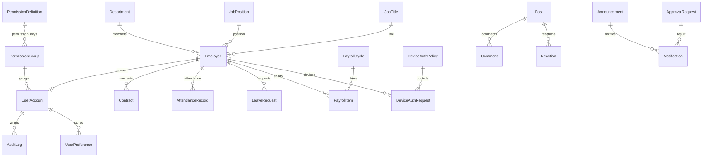
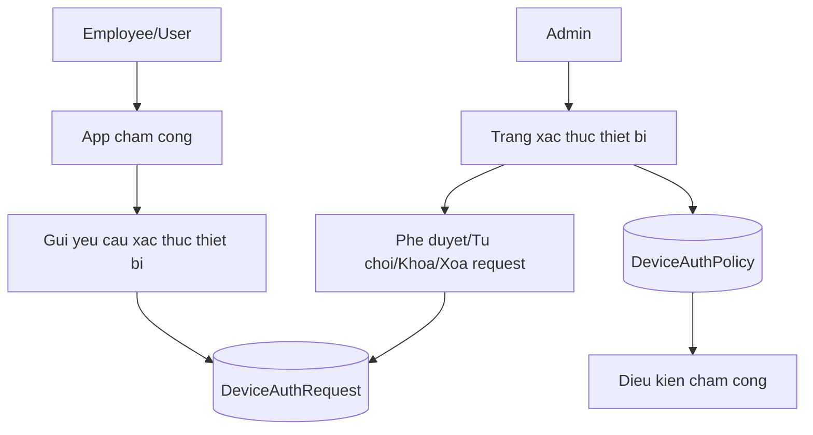
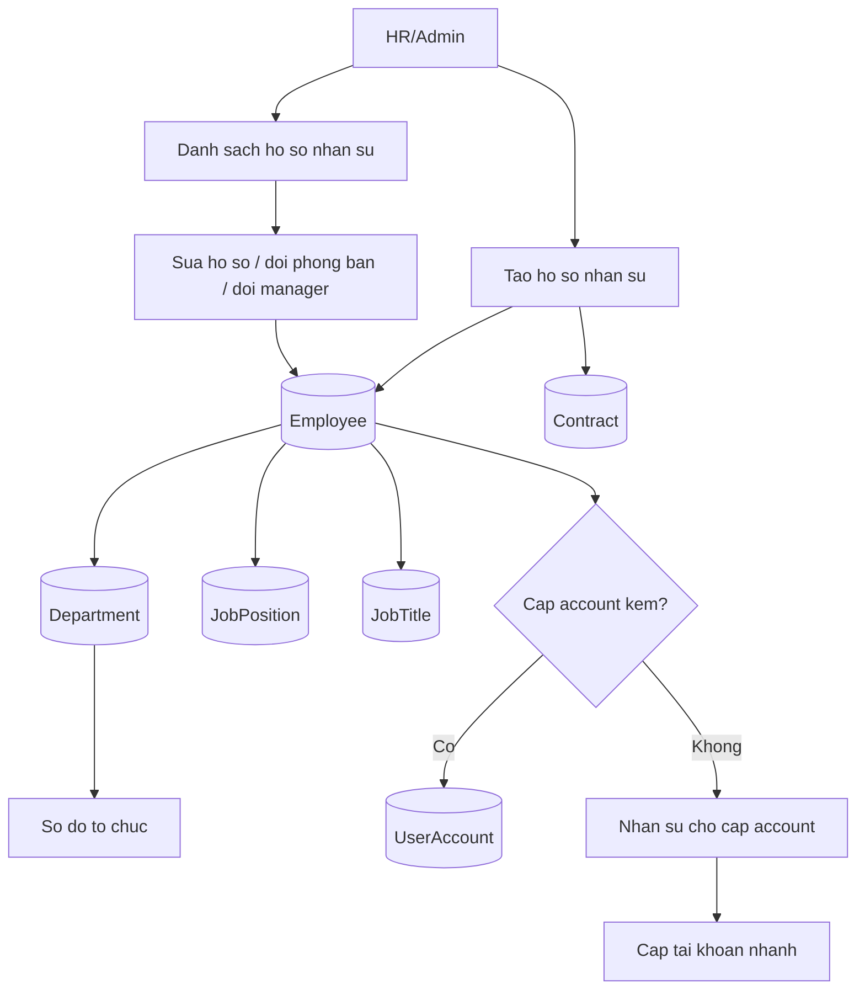
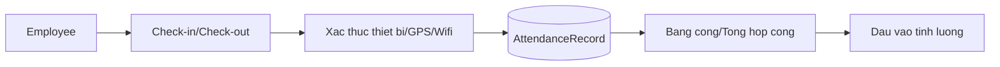
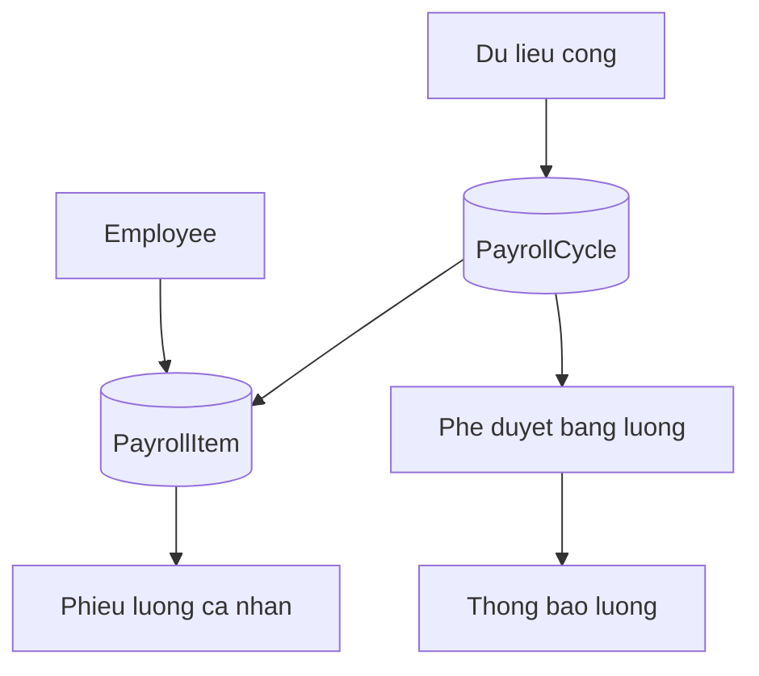
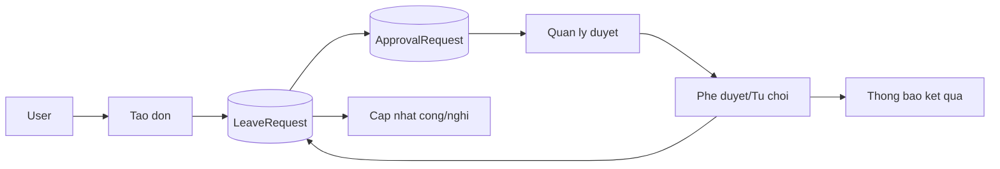
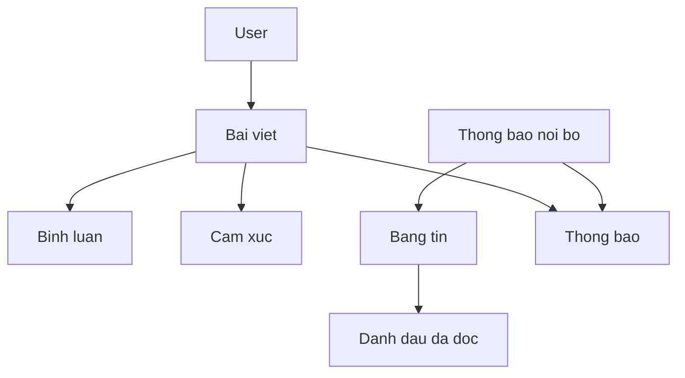
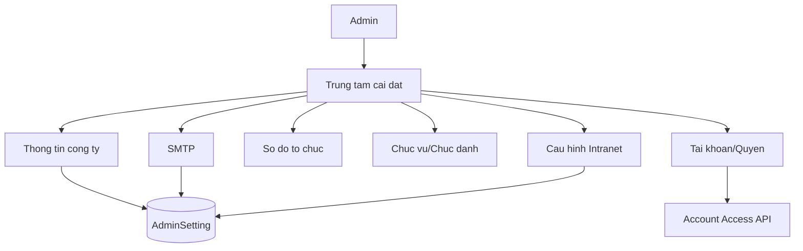

# Helios Office Feature Map

Cap nhat: 2026-07-11

Tai lieu nay la ban do chuc nang cua du an. Muc tieu la giup team nhin ro:

- Chuc nang nao da co UI.
- Chuc nang nao da noi API/DB that.
- Chuc nang nao van con mock hoac chi la prototype.
- Cac chuc nang lien ket voi nhau qua route, API, model va luong nghiep vu nao.

## Ky Hieu Trang Thai

| Trang thai | Y nghia |
| --- | --- |
| Done | UI, API va DB da noi thanh luong co the dung duoc. |
| Partial | Da co mot phan UI/API/DB nhung luong nghiep vu chua day du. |
| Mock | Co UI hoac API tra mock/static data, chua noi DB that. |
| Planned | Moi co y tuong/schema/vi tri trong he thong, chua co luong dung duoc. |

## Tong Quan Kien Truc

```mermaid
flowchart TD
  Web[apps/web - Next.js App Router] --> Api[apps/api - NestJS REST API]
  Api --> Db[(PostgreSQL - Prisma)]
  Api --> Keycloak[Keycloak - Auth/OIDC]
  Api --> Redis[(Redis - future queue/cache)]
  Api --> Minio[(MinIO - future file storage)]

  Web --> Login[/login]
  Web --> UserShell[/user/*]
  Web --> AdminShell[/admin/*]

  AdminShell --> AccountSettings[/admin/settings/accounts]
  AdminShell --> EmployeeDirectory[/admin/hr/employees]
  AdminShell --> OrgSettings[/admin/settings/org-chart]
  AdminShell --> CompanySettings[/admin/settings/company-info]
  UserShell --> Attendance[/user/attendance]
  UserShell --> Payroll[/user/payroll]
  UserShell --> Requests[/user/requests]
```

## Route Map

| Route | Man hinh | Trang thai | Ghi chu |
| --- | --- | --- | --- |
| `/` | Dashboard/PWA shell | Mock | Dung nhieu mock data cho feed, workflow, widget. |
| `/login` | Dang nhap app | Done | Dang nhap qua Keycloak password grant, set session cookie. |
| `/social` | Bang tin/social | Mock | UI co, backend posts hien tra mock. |
| `/user` | Trang nguoi dung | Mock | Shell va widget user. |
| `/user/attendance` | Cong ca nhan | Partial | Co API attendance doc du lieu, chua full workflow cham cong. |
| `/user/payroll` | Luong ca nhan | Partial | Co API payroll doc chu ky, chua full payslip/action. |
| `/user/profile` | Ho so ca nhan | Partial | Co UI, du lieu ca nhan chua noi day du theo current user. |
| `/user/requests` | Danh sach don tu | Partial | Co API leave request doc du lieu. |
| `/user/requests/new` | Tao don tu | Partial | UI co, luu DB/action chua dong bo day du. |
| `/user/requests/detail` | Chi tiet don | Partial | UI co, chua ro routing theo id that. |
| `/admin/accounts` | Alias | Done | Redirect sang `/admin/settings/accounts`. |
| `/admin/hr/employees` | Danh sach ho so nhan su | Done baseline | Bang nhan su, modal sua ho so, link/unlink account. |
| `/admin/hr/employees/new` | Tao ho so nhan su | Done baseline | Tao employee va co tuy chon cap account. |
| `/admin/settings` | Trung tam cai dat | Partial | Doc AdminSettings API, merge `AdminSetting` DB cho SMTP/company/intranet/module config. |
| `/admin/settings/accounts` | Tai khoan nguoi dung | Done | Da noi account API/DB/Keycloak. |
| `/admin/settings/accounts/groups` | Nhom quyen | Done | CRUD group da noi API/DB, co archive an toan thay vi xoa cung. |
| `/admin/settings/accounts/permissions` | Ma tran quyen chi tiet | Partial | UI co, catalog/quyen chi tiet con static/mot phan. |
| `/admin/settings/accounts/device-auth` | Xac thuc thiet bi | Done | Da noi API/DB policy va request. |
| `/admin/settings/org-chart` | So do to chuc | Partial | Department tree/table/doc API that, tao/sua/archive/restore phong ban da co. |
| `/admin/settings/positions-titles` | Vi tri/chuc danh | Done baseline | CRUD JobPosition/JobTitle da co API/DB/UI, archive an toan va audit. |
| `/admin/settings/company-info` | Thong tin cong ty | Done | Doc/ghi `AdminSetting`, sua bang modal va audit. |
| `/admin/settings/smtp` | SMTP | API/DB | Luu AdminSetting, test email that, sync Keycloak SMTP. |
| `/admin/settings/intranet` | Cau hinh intranet | Done | Doc/ghi `AdminSetting` cho branding/newsfeed/privacy/communication preset. |

## API Module Map

| API module | Endpoint chinh | Du lieu | Trang thai |
| --- | --- | --- | --- |
| `auth` | `GET /auth/me` | Keycloak + UserAccount | Done |
| `account-access` | `/account-access/accounts`, `/groups`, `/permissions` | UserAccount, PermissionGroup, PermissionDefinition | Done/Partial |
| `user-preferences` | `/user-preferences/:scope` | UserPreference | Done |
| `device-auth` | `/device-auth/requests`, `/policy` | DeviceAuthRequest, DeviceAuthPolicy | Done |
| `employees` | `/employees`, `/employees/org-chart`, `/departments`, `/job-positions`, `/job-titles`, `/contracts` | Employee, Department, JobPosition, JobTitle, Contract | Done baseline/Partial |
| `attendance` | `/attendance`, `/attendance/summary` | AttendanceRecord | Partial |
| `leave-requests` | `/leave-requests` | LeaveRequest | Partial |
| `payroll` | `/payroll-cycles`, `/payroll-cycles/workflow` | PayrollCycle, PayrollItem | Partial |
| `admin-settings` | `/admin-settings/*` | AdminSetting + default catalog | Partial/Done cho SMTP/company/intranet/module config |
| `posts` | `/posts` | Mock/static, Post schema exists | Mock |
| `announcements` | `/announcements` | Mock/static, Announcement schema exists | Mock |
| `approvals` | `/approvals`, `/approvals/:id/decision` | Mock/static, ApprovalRequest schema exists | Mock/Partial |
| `notifications` | `/notifications/unread` | Mock/static, Notification schema exists | Mock |
| `reports` | `/reports/executive-dashboard` | Mock/static | Mock |

## Data Model Map



## HR Master Data Boundary

| Khai niem | Dung de lam gi | Khong dung de lam gi |
| --- | --- | --- |
| Department | Cau truc phong ban, cap cha/con, truong phong, org chart. | Khong dai dien nghe nghiep/cap bac hay quyen truy cap. |
| JobPosition | Vi tri chuyen mon/nghe nghiep gan vao ho so nhan su. | Khong cap quyen he thong va khong tinh phi license. |
| JobTitle | Chuc danh/cap bac trong to chuc, dung hien thi va bao cao nhan su. | Khong thay the group quyen hay department. |
| PermissionGroup | Bo quyen truy cap ung dung gan cho UserAccount. | Khong dai dien phong ban, chuc vu hay goi license doanh nghiep. |

## Chuc Nang 1 - Auth Va Tai Khoan

Trang thai: Done baseline cho login/account lifecycle va permission catalog API; UI permission detail hien o che do inspect.

Thanh phan:

- UI: `/login`, `/admin/settings/accounts`, `/admin/settings/accounts/groups`, `/admin/settings/accounts/permissions`.
- API: `auth`, `account-access`.
- DB: `UserAccount`, `PermissionGroup`, `PermissionDefinition`, `AuditLog`.
- Ngoai he thong: Keycloak realm `helios-office`, client `helios-office-web`.

```mermaid
flowchart LR
  Admin[Admin] --> Login[Login app]
  Login --> Keycloak[Keycloak token]
  Keycloak --> Session[Web session cookie]
  Session --> AdminGuard[/admin guard]
  AdminGuard --> AccountPage[Quan tri tai khoan]

  AccountPage --> CreateAccount[Cap tai khoan]
  AccountPage --> EditAccount[Sua tai khoan]
  AccountPage --> CloseAccount[Dong tai khoan]
  AccountPage --> ArchiveGroup[Luu tru nhom quyen]
  CreateAccount --> UserAccount[(UserAccount)]
  EditAccount --> UserAccount
  CloseAccount --> UserAccount
  UserAccount --> KeycloakSync[Dong bo Keycloak user]
  CreateAccount --> PasswordPolicy[Password tam + UPDATE_PASSWORD]
  PasswordPolicy --> KeycloakSync
  CreateAccount --> InviteHook[Invite email hook]
  InviteHook --> Audit
  UserAccount --> Group[PermissionGroup]
  ArchiveGroup --> Group
  UserAccount --> Audit[AuditLog]
```

Da trien khai:

- Login khong day nguoi dung sang form Keycloak mac dinh.
- Session cookie co access/refresh token.
- Admin guard bao ve `/admin/*`.
- Cap tai khoan nhanh cho nhan su chua co account.
- Tao/sua/dong/kich hoat account co sync Keycloak.
- CRUD nhom quyen va archive an toan cho nhom khong con account.
- User/group license da bo khoi UI va frontend/API contract hien tai.
- API account tra `effectivePermissionKeys` de UI dung cung mot logic tinh quyen.
- Cac sidebar `/user`, `/admin`, `/hcns` co tuy chinh module theo account. `/user` loc module theo quyen `menu.*` hoac quyen nghiep vu tuong ung; admin/HCNS dung catalog rieng. Cau hinh duoc luu vao `UserPreference` theo scope `user.sidebar`, `admin.sidebar`, `hcns.sidebar`.
- Permission catalog da co model `PermissionDefinition`, seed vao DB, API doc tu DB, va man hinh quyen chi tiet doc du lieu that.
- API guard theo permission key da ap dung cho account/group, device-auth, employee/department endpoints chinh.
- Cap tai khoan moi co password tam, optional `UPDATE_PASSWORD`, metadata invite va audit invite sent/skipped/deferred/failed.

Con thieu/nen lam:

- UI cau hinh SMTP/test mail va nut gui lai invite/reset password da co baseline.
- SMTP secret da duoc ma hoa bang `SETTINGS_SECRET_KEY`.
- Tiep theo: them toast/notification ro hon cho resend invite.
- Ra soat guard cho cac read endpoint phu nhu contracts khi noi UI admin that.

## Chuc Nang 2 - Xac Thuc Thiet Bi

Trang thai: Done cho policy/request CRUD hien tai.

Thanh phan:

- UI: `/admin/settings/accounts/device-auth`.
- API: `device-auth`.
- DB: `DeviceAuthPolicy`, `DeviceAuthRequest`.
- Lien ket nghiep vu: Cham cong app/PWA, account active, employee.



Da trien khai:

- Doc/cap nhat policy.
- Danh sach request.
- Duyet/tu choi/khoa/xoa request.

Con thieu/nen lam:

- Noi request thiet bi voi app cham cong that.
- Ap dung policy vao luong check-in/check-out.
- Audit log cho moi thay doi thiet bi.

## Chuc Nang 3 - Ho So Nhan Su Va To Chuc

Trang thai: Done baseline cho HR master data; Partial cho nghiep vu profile/contract sau.

Thanh phan:

- UI: `/admin/hr/employees`, `/admin/hr/employees/new`, `/admin/settings/org-chart`, `/admin/settings/positions-titles`.
- API: `employees`, `departments`, `job-positions`, `job-titles`, `contracts`.
- DB: `Employee`, `Department`, `JobPosition`, `JobTitle`, `Contract`, `UserAccount`.



Da trien khai:

- API tao employee.
- API doc employees/departments/contracts/org chart.
- Tao employee co tuy chon cap account.
- Trang account co the cap nhanh account cho employee chua co account.
- CRUD phong ban baseline: tao/sua/chuyen parent/gan truong phong/archive/restore.
- Org chart UI doc department API that cho cay phong ban, chi tiet va bang danh sach.
- Department mutations co guard permission, validation parent/head va ghi audit.
- CRUD vi tri/chuc danh baseline: model/API/UI, archive/restore an toan va audit.
- Form tao ho so nhan su chon JobPosition/JobTitle tu catalog active.
- Employee da luu cac truong ho so bo sung: avatar, loai nhan su, ngay chinh thuc, ma cham cong, hinh thuc cham cong, bang luong, cong chuan.
- API `PATCH /employees/:id` cho phep sua ho so, doi department/position/title/manager/status va ghi audit.
- API `PATCH /employees/:id/account` cho phep link/unlink ho so voi UserAccount, co chan account da gan cho nhan su khac.
- Validation reporting line: department phai active, manager phai active, khong cho self-manager va khong tao vong quan ly.
- UI `/admin/hr/employees` co bang ho so, modal sua, lien ket tai khoan va duong dan tao ho so moi.

Con thieu/nen lam:

- Chi tiet lich su hop dong/qua trinh cong tac cho tung nhan su.
- Noi `/user/profile` vao current employee that thay vi mock.
- Dung reporting line cho approval workflow o Phase 5.

## Chuc Nang 4 - Cham Cong

Trang thai: Partial.

Thanh phan:

- UI: `/user/attendance`.
- API: `attendance`.
- DB: `AttendanceRecord`.
- Phu thuoc: Employee, DeviceAuthPolicy, DeviceAuthRequest.



Da trien khai:

- API doc record cham cong.
- API summary cham cong.
- UI bang cong ca nhan.

Con thieu/nen lam:

- Action check-in/check-out that.
- Xin sua cong/bo sung cong.
- Rang buoc device policy vao cham cong.
- Dong bo bang cong admin va user theo thang.

## Chuc Nang 5 - Luong

Trang thai: Partial.

Thanh phan:

- UI: `/user/payroll`.
- API: `payroll`.
- DB: `PayrollCycle`, `PayrollItem`.
- Phu thuoc: Employee, AttendanceRecord, ApprovalRequest.



Da trien khai:

- API doc payroll cycles.
- API doc workflow payroll mau.
- UI luong ca nhan.

Con thieu/nen lam:

- Tinh luong tu bang cong/phu cap/khau tru.
- Phieu luong theo employee dang login.
- Workflow duyet/chot bang luong that.
- Bao mat va audit cho du lieu luong.

## Chuc Nang 6 - Don Tu Va Phe Duyet

Trang thai: Partial/Mock.

Thanh phan:

- UI: `/user/requests`, `/user/requests/new`, `/user/requests/detail`.
- API: `leave-requests`, `approvals`.
- DB: `LeaveRequest`, `ApprovalRequest`, `Notification`.
- Phu thuoc: Employee, Department, manager/reporting line.



Da trien khai:

- UI danh sach/tao/chi tiet don.
- API doc leave request.
- API approvals co endpoint decision nhung service con mock.

Con thieu/nen lam:

- POST tao don that.
- Gan nguoi duyet theo org chart.
- Luu decision vao DB.
- Cap nhat attendance/payroll sau khi don duoc duyet.

## Chuc Nang 7 - Intranet, Feed, Thong Bao

Trang thai: Mock.

Thanh phan:

- UI: `/`, `/social`, `/admin/settings/intranet`.
- API: `posts`, `announcements`, `notifications`.
- DB da co schema: `Post`, `Comment`, `Reaction`, `PostReadMark`, `Announcement`, `Notification`.



Da trien khai:

- UI feed/social/dashboard.
- API endpoints doc posts/announcements/notifications.
- Schema DB san sang.

Con thieu/nen lam:

- Noi posts/announcements/notifications vao DB.
- Tao/sua/xoa bai viet/thong bao.
- Read tracking that.
- Notification fan-out theo doi tuong nhan.

## Chuc Nang 8 - Cai Dat He Thong

Trang thai: Partial/Done cho Phase 9 baseline.

Thanh phan:

- UI: `/admin/settings`, `/admin/settings/company-info`, `/smtp`, `/org-chart`, `/positions-titles`, `/intranet`.
- API: `admin-settings`.
- DB: `AdminSetting`, nhung nhieu man hinh van dung web mock data.



Da trien khai:

- UI cac trang setting.
- API admin-settings tra dashboard tong tu default catalog merge voi `AdminSetting`.
- Schema `AdminSetting` ton tai.
- SMTP setting da sync sang Keycloak realm de dung cho invite/reset password.
- Company info doc/ghi `AdminSetting`, sua qua modal va ghi audit.
- Intranet settings doc/ghi `AdminSetting`, sua qua modal va ghi audit.
- Module config bat/tat phan he co API/DB noi bo, chua hien tren UI vi chua co logic van hanh that.
- Account/device/group settings da noi that rieng.

Con thieu/nen lam:

- Tach master data org/position/title ra module rieng.

## Muc Do That Cua Du Lieu

| Nhom du lieu | Model/schema | API | UI | Muc do that |
| --- | --- | --- | --- | --- |
| Account | Co | Co | Co | Cao |
| Permission group | Co | Co | Co | Cao |
| Permission catalog | Co | Co | Co | Cao cho read/inspect, chua co CRUD catalog |
| Device auth | Co | Co | Co | Cao |
| Employee | Co | Co | Co | Trung binh |
| Department/Org | Co | Co | Co | Trung binh/cao cho department CRUD; position/title van mock |
| Contract | Co | Co doc | It UI | Trung binh |
| Attendance | Co | Co doc | Co | Trung binh |
| Payroll | Co | Co doc | Co | Trung binh |
| Leave request | Co | Co doc | Co | Trung binh/thap |
| Approval | Co | Mock service | Co mot phan | Thap |
| Posts/Social | Co | Mock service | Co | Thap |
| Announcements | Co | Mock service | Co | Thap |
| Notifications | Co | Mock service | Co | Thap |
| Reports | Chua ro rieng | Mock service | Co | Thap |
| Company/SMTP/Intranet/Module settings | AdminSetting | Co | Co | Cao cho Phase 9 baseline |

## Thu Tu Uu Tien De Go Roi

1. Giu `docs/feature-map.md` la source of truth: moi lan them/sua module thi cap nhat route, API, DB, trang thai.
2. Chot module Account Access:
   - Invite email/password policy.
   - Ra soat endpoint phu con dung guard cu/chua guard.
3. Hoan thien master data HR:
   - Department/org chart CRUD.
   - Position/title CRUD.
   - Employee list/detail admin.
4. Hoan thien luong don tu:
   - Create request.
   - Approval decision DB.
   - Notification ket qua.
   - Anh huong sang attendance/payroll.
5. Noi Intranet/Social/Notification vao DB.
6. Phase 9 AdminSetting baseline da xong; tiep theo quay ve HR master data/Phase 3.

## Nguyen Tac Khi Lam Tiep

- Khong them UI moi neu chua biet no thuoc module nao trong file nay.
- Moi man hinh admin can co dong doi ung trong API module map.
- Moi mutation quan trong can ghi `AuditLog`.
- Mock data chi nen la fallback/dev seed, khong nen la nguon chinh cua man hinh da goi la "hoan thanh".
- Neu mot chuc nang phu thuoc chuc nang khac, uu tien lam chuc nang nen truoc. Vi du: approval phu thuoc org chart/manager, payroll phu thuoc attendance.
