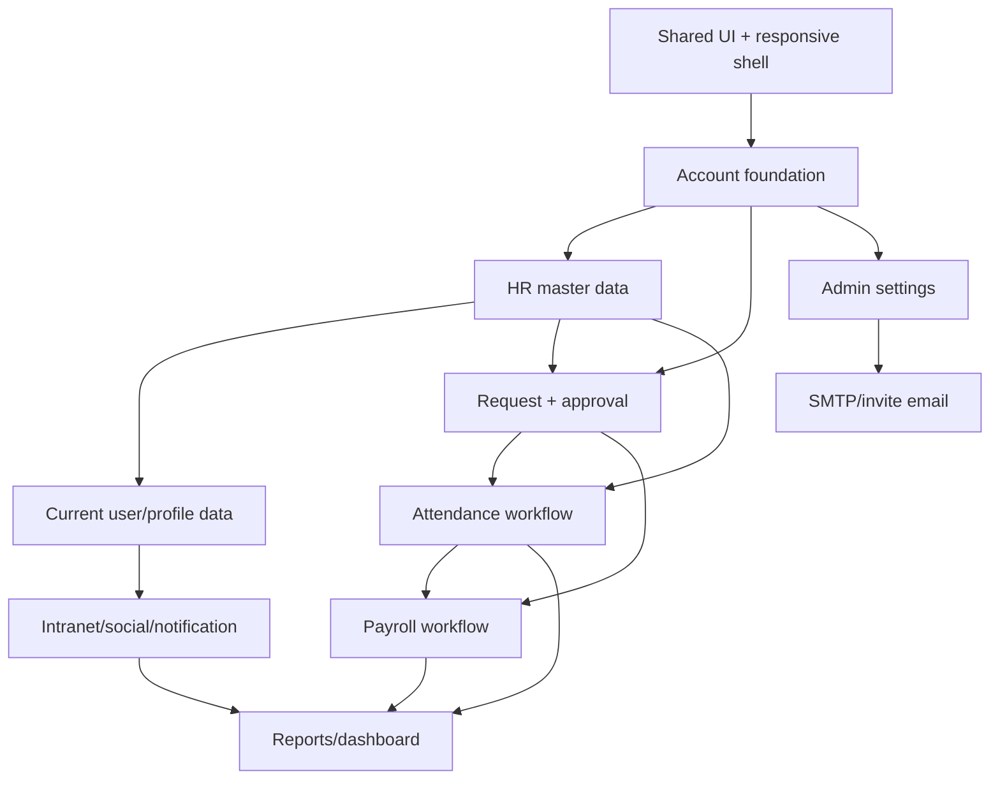

# Helios Office Implementation Plan

Cap nhat: 2026-07-11

Tai lieu nay dua tren `docs/feature-map.md` va ket qua doi chieu app thuc te. Muc tieu la bien ban do chuc nang thanh ke hoach thi cong theo thu tu dung, tranh tiep tuc them man hinh roi roi nhung khong co data flow that.

## Ket Luan Hien Trang

App hien tai co 4 lop hoan thien khac nhau:

1. Da noi that kha chac: auth/session/Keycloak, account lifecycle, permission group, device-auth.
2. Co API/DB doc du lieu nhung UI/action con thieu: employee, department/org-chart, attendance, leave request, payroll.
3. Co schema nhung service/UI van mock: posts, announcements, notifications, approvals.
4. UI prototype/mock la chinh: dashboard, social, company info, SMTP, intranet settings, positions/titles, profile board, user request forms.

Ket luan thi cong:

- Khong nen lam tiep theo chieu "them man hinh".
- Nen lam theo chieu "dong bo data boundary": moi module phai co UI -> API -> DB -> guard/permission -> audit/test.
- Nhom nen uu tien: shared UI foundation, account foundation, HR master data, current user/profile, request/approval, attendance, payroll, intranet/notification, admin settings.

## Definition Of Done Chung

Mot module chi duoc coi la hoan thanh khi co du cac muc sau:

- Route/UI dung component chung va responsive mobile/desktop.
- API endpoint co DTO validation, guard phu hop, service khong doc mock-data lam nguon chinh.
- Prisma schema/seed/migration ro rang neu co du lieu moi.
- Server action/API client tren web co loading/error/empty state.
- Mutation quan trong ghi `AuditLog`.
- Permission check duoc dat o API va UI chi an/hien de tien dung, khong thay the authorization.
- Chay pass:
  - `npm run typecheck`
  - `npm run test`
  - `npm run build`
  - Neu cham DB: `npm run db:migrate`, `npm run db:seed`
  - Neu cham Keycloak/account: `npm run keycloak:bootstrap`

## Dependency Map



## Phase 0 - Khoa Lai Nen Tang Va Data Boundary

Muc tieu: het tinh trang khong biet man hinh nao dung mock, man hinh nao dung API.

Viec can lam:

1. Giu `docs/feature-map.md` va `docs/implementation-plan.md` la source of truth.
2. Gan trang thai cho tung route trong code comment hoac doc: `api-backed`, `partial`, `mock`.
3. Tach mock data thanh 2 loai:
   - `seed/dev fixture`: du lieu dung de seed DB.
   - `ui prototype`: du lieu chi dung cho man hinh chua noi API.
4. Lap danh sach import mock-data con lai:
   - Web: `user-frame`, dashboard, social, admin settings, org-chart, company-info, smtp, intranet, position-title, detailed-permission, user boards.
   - API: admin-settings, posts, announcements, approvals, notifications, reports.
5. Tao quy tac: module nao da co API/DB thi UI khong duoc hard-code data chinh trong component.

Tieu chi xong:

- Co checklist mock usage trong doc hoac changelog.
- Moi route co trang thai ro.
- Khong co tinh nang moi nao duoc them ma khong map vao module.

Lenh kiem tra:

```bash
rg "mock-data|const .* = \\[" apps/web apps/api/src
npm run typecheck
```

## Phase 1 - Shared UI Foundation Va Responsive

Muc tieu: cham dut viec moi man hinh tu style checkbox/select/modal/table rieng, gay vo UI lien tuc.

Viec can lam:

1. Tao/hoan thien bo component chung trong `apps/web/components/ui`:
   - `Button`
   - `IconButton`
   - `Modal/Dialog`
   - `FormField`
   - `FormInput`
   - `FormTextarea`
   - `FormSelect`
   - `FormDatePicker`
   - `FormCheckbox`
   - `FormSwitch`
   - `ToolbarActions`
   - `ResponsiveTable`
   - `EmptyState`
   - `ErrorState`
   - `LoadingState`
2. Chuan hoa CSS token:
   - Khong them raw hex ngoai token neu khong can.
   - Check lai `letter-spacing`, font-size, radius, spacing.
3. Chuan hoa responsive shell:
   - `UserFrame`
   - `Admin layout`
   - `user-mobile-nav`
   - `bottom-nav`
   - noi dung khong duoc tao horizontal overflow ngoai table shell.
4. Migrate cac man dang loi/nhay style sang component chung:
   - account dialog
   - provision dialog
   - device-auth policy form
   - employee create form
   - request create forms
   - settings tables
5. Tao manual QA viewport:
   - 390px
   - 425px
   - 768px
   - 1024px
   - 1440px

Tieu chi xong:

- Khong con checkbox/select/button mac dinh o cac form da migrate.
- Mobile khong con horizontal overflow tren:
  - `/admin/settings/accounts`
  - `/admin/settings/accounts/groups`
  - `/admin/settings/accounts/device-auth`
  - `/admin/hr/employees/new`
  - `/user/requests/new?type=leave`
  - `/user/attendance`
- Dialog footer tren mobile khong bi tach cot vo ly.

Lenh kiem tra:

```bash
npm run typecheck -w apps/web
npm run build -w apps/web
```

## Phase 2 - Hoan Thien Account Foundation

Muc tieu: account va permission thanh nen that cho toan bo he thong.

Trang thai hien tai:

- Account lifecycle: Done.
- Permission group CRUD + safe archive: Done.
- User/group license UI: Removed, DB field giu default noi bo de tranh migration lon.
- Permission catalog: Done cho DB seed/API source va mutation an toan.
- Effective permission: Done baseline, API tra `effectivePermissionKeys` theo role + group + override + lifecycle.
- Invite/password policy: Done baseline for provisioning.

Viec can lam:

1. Persist permission catalog:
   - Them schema `PermissionDefinition`: Done.
   - Seed permission keys hien co tu static catalog: Done.
   - API `GET /account-access/permissions` doc tu DB/catalog service that: Done.
   - API `POST/PATCH/DELETE /account-access/permissions`: Done, delete chi cho phep khi quyen chua duoc group/custom account dung.
2. Chuan hoa effective permission:
   - Role base permission.
   - Group permission.
   - Per-user override.
   - Account lifecycle status.
   - Archived group khong duoc gan moi va khong tinh effective permission.
   - Validate permission keys khi cap/sua account va group: Done.
3. Hoan thien detailed permission screen:
   - Bo phu thuoc `detailedPermissionObjects` mock: Done.
   - Noi theo permission catalog/effective permission: Done.
   - Mutation permission definition da co o API; UI hien tai van inspect/read-only de tranh Admin sua catalog khi chua co flow review.
4. Invite/password:
   - Tao password tam va yeu cau Keycloak `UPDATE_PASSWORD`: Done.
   - Luu metadata `passwordResetRequired`, `temporaryPasswordIssuedAt`, `inviteEmailRequested`, `inviteSentAt`: Done.
   - Chuan bi SMTP/Keycloak email hook bang `ACCOUNT_INVITE_EMAIL_ENABLED`: Done.
   - Log audit khi cap account va invite sent/skipped/deferred/failed: Done.
   - Tiep theo: UI cau hinh SMTP/test mail va nut gui lai invite/reset password.
5. API guard:
   - Tao helper check permission tren API: Done.
   - Ban dau ap dung cho account/device/employee mutations: Done.
   - Guard them cho contracts/reports read endpoints: Done.
   - Tiep theo: cac module Phase 4-8 se siết guard rieng khi noi DB/workflow that.

Tieu chi xong:

- Xem account/group/permission khong can mock catalog lam source chinh.
- Cap/sua/dong account dong bo Keycloak va audit log day du.
- Permission group thay doi co anh huong ro den effective permissions.
- Admin khong co permission phu hop bi API chan, khong chi an nut tren UI.
- Khong con license theo user/group trong UI, frontend contract, hay permission catalog.

Lenh kiem tra:

```bash
npm run db:migrate -w apps/api
npm run db:seed -w apps/api
npm run keycloak:bootstrap -w apps/api
npm run typecheck
npm run test
npm run build
```

## Phase 3 - HR Master Data: Employee, Department, Position, Org Chart

Muc tieu: HR master data thanh trung tam de cac module approval, attendance, payroll dung chung.

Trang thai hien tai:

- Employee create API: Partial/usable.
- Department CRUD: Done baseline voi create/update/archive/restore, guard, audit va validation an toan.
- Org chart UI/API: Done baseline cho department tree, detail, table va gan truong phong bang API.
- Position/title: Done baseline voi JobPosition/JobTitle model, API, UI, archive/restore va audit.
- Employee directory admin: Done baseline voi list, edit modal, link/unlink account, manager validation.

Viec can lam:

1. Schema:
   - `JobPosition` va `JobTitle` da tach khoi string title de lam HR master data.
   - `Employee.positionId` va `Employee.jobTitleId` da noi relation; `Employee.title` con la display title de tuong thich UI cu.
   - Employee da co them truong ho so bo sung: `officialStartDate`, `employeeType`, `avatarUrl`, `attendanceCode`, `attendanceMode`, `payrollTemplate`, `standardWorkdays`.
   - `Employee.managerId` da duoc validate de tranh self-manager va reporting cycle.
2. Department CRUD:
   - `POST /departments`: Done.
   - `PATCH /departments/:id`: Done.
   - `POST /departments/:id/archive`: Done, archive an toan thay vi xoa cung.
   - `POST /departments/:id/restore`: Done.
   - validation khong archive department con employee active hoac department con: Done.
3. Position/title CRUD:
   - API `/job-positions` va `/job-titles`: Done baseline.
   - UI `/admin/settings/positions-titles` dung API: Done baseline.
   - Archive/restore an toan, chan archive khi con nhan su dang gan: Done.
   - Audit log hien action/target cu the: Done.
4. Org chart:
   - UI `/admin/settings/org-chart` doc API thay mock department: Done.
   - Them action tao/sua/move department: Done cho tao/sua/chuyen parent.
   - Gan head/manager cho department: Done cho department head.
5. Employee directory:
   - Route `/admin/hr/employees`: Done baseline.
   - Bang danh sach nhan su doc API: Done.
   - Modal edit employee, gom Department/JobPosition/JobTitle/manager/status/cham cong/luong: Done baseline.
   - Link/unlink account: Done baseline.
   - Chi tiet employee day du, lich su hop dong va qua trinh cong tac: chuyen sang Phase 4/5 neu can cho profile/workflow.
6. Seed:
   - Seed du lieu 3-5 department, 5-8 employees, co employee chua co account de test quick provisioning.

Tieu chi xong:

- Tao employee moi xuat hien trong org chart va account provisioning.
- Manager/reporting line co the dung cho approval.
- Position/title khong con mock.
- Org chart UI khong con dung `organizationTree` tu web mock-data lam source chinh.
- Employee directory co the sua department/position/title/manager va lien ket account.

Lenh kiem tra:

```bash
npm run db:migrate -w apps/api
npm run db:seed -w apps/api
npm run typecheck
npm run test
npm run build
```

## Phase 4 - Current User Va Profile Data

Muc tieu: nguoi dang nhap thay du lieu cua minh, khong phai `currentUser` mock.

Trang thai hien tai:

- `/auth/me` da co.
- `UserFrame` van import `currentUser` tu mock-data.
- Profile board hard-code nhieu mang data.

Viec can lam:

1. Mo rong `GET /auth/me`:
   - account
   - employee
   - department
   - permissions
   - avatar/displayName
2. Tao API profile:
   - `GET /profile/me`
   - `PATCH /profile/me/basic` neu cho user sua thong tin ca nhan.
   - `GET /profile/me/contracts`
   - `GET /profile/me/payroll-summary`
   - `GET /profile/me/leave-balance`
3. Web:
   - `UserFrame` nhan user tu server/auth thay vi mock.
   - `ProfileMenu`, `TopNav`, `LeftSidebar` dung current user that.
   - `/user/profile` doc profile API.
4. Data fallback:
   - Khi API loi, hien ErrorState, khong silently dung mock lam du lieu that.

Tieu chi xong:

- Login user khac thi header/profile doi theo user do.
- User dong/disabled khong vao app duoc.
- Profile khong con hard-code thong tin ca nhan chinh.

Lenh kiem tra:

```bash
npm run typecheck
npm run test
npm run build
```

## Phase 5 - Don Tu Va Approval Workflow

Muc tieu: hoan thien luong tao don -> duyet -> thong bao -> cap nhat nghiep vu.

Trang thai hien tai:

- UI request list/create/detail co.
- Request create forms hard-code data va submit chua noi that.
- `leave-requests` moi doc.
- `approvals` service dang mock.
- Schema `LeaveRequest`, `ApprovalRequest`, `Notification` da co.

Viec can lam:

1. Chot domain model:
   - De `LeaveRequest` bao gom leave/absence/overtime/checkin-out/shift-change/resignation hay tao `Request` generic.
   - Neu giu `LeaveRequest`, them `type`, `payload`, `dateRange`, `hours`, `reason`, `status`.
2. API:
   - `POST /leave-requests`
   - `GET /leave-requests/me`
   - `GET /leave-requests/:id`
   - `PATCH /leave-requests/:id/cancel`
   - `GET /approvals`
   - `POST /approvals/:id/decision` ghi DB that.
3. Approval routing:
   - Lay approver tu `Employee.managerId` hoac department head.
   - Fallback HR admin neu khong co manager.
4. Web:
   - `/user/requests` doc request cua user.
   - `/user/requests/new` submit server action.
   - `/user/requests/detail?id=...` hoac route dynamic `/user/requests/[id]`.
   - Them admin/manager approval view neu can.
5. Notification:
   - Tao notification khi tao don.
   - Tao notification khi duyet/tu choi.
6. Audit:
   - Tao don, huy don, duyet, tu choi deu ghi log.

Tieu chi xong:

- User tao don nghi phep, DB co record.
- Manager thay don can duyet.
- Duyet don cap nhat status va user thay ket qua.
- Khong con approvals mock lam source chinh.

Lenh kiem tra:

```bash
npm run db:migrate -w apps/api
npm run db:seed -w apps/api
npm run typecheck
npm run test
npm run build
```

## Phase 6 - Attendance Workflow

Muc tieu: bang cong khong chi la lich hien thi ma co workflow cham cong/xin sua cong.

Trang thai hien tai:

- API doc attendance records.
- UI bang cong hard-code ngay/thang.
- Device auth da co policy/request nhung chua ap dung vao check-in.

Viec can lam:

1. API:
   - `GET /attendance/me?month=YYYY-MM`
   - `POST /attendance/check-in`
   - `POST /attendance/check-out`
   - `POST /attendance/adjustment-requests`
   - `GET /attendance/admin?month=YYYY-MM`
2. Device policy enforcement:
   - Check active account.
   - Check approved device neu policy bat.
   - Check GPS/Wifi neu policy bat.
3. UI:
   - `/user/attendance` doc API theo thang.
   - Month picker request data that.
   - Empty/loading/error states.
   - Nut tao don checkin/out dung request workflow Phase 5.
4. Admin:
   - Bang cong toan cong ty can route/man hinh rieng neu can.
   - Review record bat thuong.
5. Payroll handoff:
   - Summary cong da chot lam input payroll.

Tieu chi xong:

- User doi thang thi data doi theo API.
- Check-in/out tao record that.
- Device chua duyet bi chan neu policy bat.
- Xin sua cong tao approval request.

Lenh kiem tra:

```bash
npm run typecheck
npm run test
npm run build
```

## Phase 7 - Payroll Workflow

Muc tieu: luong dung du lieu cong va employee, co phieu luong ca nhan va luong can bao mat.

Trang thai hien tai:

- API doc payroll cycles.
- UI salary hard-code months/details.
- Schema payroll cycle/item co.

Viec can lam:

1. API:
   - `GET /payroll-cycles`
   - `POST /payroll-cycles`
   - `POST /payroll-cycles/:id/calculate`
   - `POST /payroll-cycles/:id/submit`
   - `POST /payroll-cycles/:id/approve`
   - `GET /payroll/me?cycleId=...`
2. Calculation:
   - Lay attendance summary.
   - Lay contract/salary base neu co.
   - Luu payroll items.
3. Permission:
   - Chi payroll admin/HR duoc xem bang luong tong.
   - User chi xem phieu luong cua minh.
4. UI:
   - `/user/payroll` doc payslip cua current user.
   - Them admin payroll screen khi can.
5. Security:
   - Audit moi lan xem/sua/chot payroll.
   - Chuan bi encryption cho sensitive fields truoc production.

Tieu chi xong:

- Payroll cycle co the tao, tinh, submit, approve.
- User xem dung phieu luong cua minh.
- Account khong co quyen bi API chan.

Lenh kiem tra:

```bash
npm run typecheck
npm run test
npm run build
```

## Phase 8 - Intranet, Social, Announcements, Notifications

Muc tieu: dashboard/social khong con la demo, co du lieu that va thong bao that.

Trang thai hien tai:

- UI feed/social co.
- API posts/announcements/notifications tra mock.
- Schema DB da co.

Viec can lam:

1. Posts:
   - `GET /posts`
   - `POST /posts`
   - `POST /posts/:id/comments`
   - `POST /posts/:id/reactions`
   - `POST /posts/:id/read`
2. Announcements:
   - CRUD announcement.
   - Target theo all/company/department/group/user.
   - Read acknowledgment.
3. Notifications:
   - Persist notification.
   - `GET /notifications/unread`
   - `PATCH /notifications/:id/read`
   - Tao notification tu request approval, announcement, comment/reaction neu can.
4. Web:
   - `/social` doc posts API.
   - Dashboard `/` doc announcements/posts/workflows API.
   - Top nav unread count dung API.
5. Settings:
   - `/admin/settings/intranet` chuyen tu mock sang config DB neu can.

Tieu chi xong:

- Tao bai viet hien tren social va dashboard.
- Comment/reaction luu DB.
- Notification unread doi theo user.
- Announcements co read tracking.

Lenh kiem tra:

```bash
npm run db:migrate -w apps/api
npm run db:seed -w apps/api
npm run typecheck
npm run test
npm run build
```

## Phase 9 - Admin Settings: Company, SMTP, Module Config

Muc tieu: cac trang setting con lai khong con chi la UI.

Trang thai hien tai:

- UI company-info/smtp/admin-settings/intranet co.
- `admin-settings` API da merge dashboard tong tu `AdminSetting`, audit log va default catalog.
- SMTP da co DB/API mutation that.
- Company info da luu vao `AdminSetting`.
- Intranet settings da luu vao `AdminSetting`.
- Module config bat/tat phan he da co API/DB noi bo, nhung khong hien tren UI Admin vi chua co tac dung van hanh that.
- `AdminSetting` schema co.

Viec can lam:

1. Chuan hoa `AdminSetting`:
   - Key/value JSON.
   - Tier/status.
   - UpdatedBy/updatedAt neu can.
2. API:
   - `GET /admin-settings`: Done, dashboard tong merge DB + default catalog.
   - `GET /admin-settings/:key`: Done cho setting item trong snapshot.
   - `GET/PATCH /admin-settings/smtp`: Done.
   - `POST /admin-settings/smtp/test`: Done, gui email that qua SMTP.
3. Company info:
   - Chuyen company identity/contact/legal/bank/assets sang AdminSetting: Done.
4. SMTP:
   - Luu cau hinh vao `AdminSetting`: Done.
   - Test SMTP: Done.
   - Sync SMTP sang Keycloak realm de dung cho invite/reset password: Done.
   - Ma hoa secret password bang `SETTINGS_SECRET_KEY`: Done.
   - Toast/notification ro hon cho resend invite: Done baseline inline feedback.
5. Module config:
   - Luu config bat/tat module: Done noi bo.
   - UI bat/tat module: Removed de tranh gay hieu nham khi chua co logic an menu/chan route/chan API.
6. Intranet settings:
   - Luu branding/newsfeed/privacy/communication preset vao AdminSetting: Done.

Tieu chi xong:

- Sua company info reload van con.
- Test SMTP co ket qua that: Done.
- Cap account moi/gui lai invite co the dung SMTP neu da sync Keycloak: Done.
- AdminSetting mutations ghi audit.

Trang thai: Done baseline cho Phase 9. Cac setting con lai nhu org-chart/positions-title thuoc Phase 3, khong tinh vao Phase 9.

Lenh kiem tra:

```bash
npm run typecheck
npm run test
npm run build
```

## Phase 10 - Reports, Audit, Production Hardening

Muc tieu: bien app tu demo noi bo thanh nen san sang test nghiem tuc.

Viec can lam:

1. Reports:
   - Bo `reports` mock.
   - Dashboard reports doc tu employee/attendance/payroll/request/post.
2. Audit:
   - Account, employee, org, attendance, payroll, approval, settings mutation deu ghi log.
   - Them man hinh audit/log neu can.
3. Authorization:
   - Permission guard dung effective permission.
   - Kiem tra scope phong ban/manager.
4. Error handling:
   - API error format thong nhat.
   - Web error state thong nhat.
5. Seed/dev ops:
   - Seed scenario du test:
     - admin
     - manager
     - employee active
     - employee pending account
     - closed account
     - pending approval
     - payroll cycle
6. Release checklist:
   - `.env.example` day du.
   - README quick start dung.
   - Swagger docs cap nhat.
   - Backup/migration note.

Tieu chi xong:

- Dashboard executive khong con mock.
- Audit log co du mutation quan trong.
- Permission/scope duoc test o API.
- Local fresh setup chay duoc tu README.

Lenh kiem tra:

```bash
docker compose up -d postgres redis keycloak minio
npm install
npm run db:migrate
npm run db:seed
npm run keycloak:bootstrap
npm run typecheck
npm run test
npm run build
```

## Thu Tu Commit De Thi Cong

Day la thu tu commit khuyen nghi, moi commit nen nho va co the review rieng:

1. `docs: add feature implementation plan`
2. `refactor(web): add shared ui primitives`
3. `fix(web): standardize responsive shells and tables`
4. `feat(account): persist permission catalog`
5. `feat(account): enforce effective permissions`
6. `feat(hr): add department and position master data`
7. `feat(hr): wire org chart to api data`
8. `feat(hr): add employee directory and detail`
9. `feat(user): load current user and profile from api`
10. `feat(requests): create request api and user actions`
11. `feat(approvals): persist approval decisions`
12. `feat(attendance): wire attendance calendar to api`
13. `feat(attendance): add check-in device policy enforcement`
14. `feat(payroll): add payroll cycle calculation flow`
15. `feat(intranet): persist posts and announcements`
16. `feat(notifications): persist unread notifications`
17. `feat(settings): persist company and smtp settings`
18. `feat(reports): replace mock executive dashboard`
19. `chore(seed): add complete local demo scenario`
20. `chore(release): harden docs, env, and smoke checklist`

## Viec Nen Lam Ngay Tiep Theo

Thu tu gan nhat nen lam:

1. Phase 1: tao bo UI primitives va responsive shell.
2. Sau do sua nhung man hinh da dung nhieu nhat:
   - account table/dialog
   - group dialog
   - device-auth policy
   - employee create
3. Phase 2: persist permission catalog va effective permission.
4. Phase 3: HR master data, vi approval/attendance/payroll deu phu thuoc manager/department/position.

Ly do khong nen nhay ngay sang don tu/payroll:

- Don tu can manager/reporting line that.
- Attendance can employee/current user/device policy.
- Payroll can attendance va permission bao mat.
- Dashboard/social can notification/current user.

## Checklist Moi Lan Hoan Thanh Mot Phase

- Cap nhat `docs/feature-map.md` status cua route/module.
- Cap nhat file nay neu thu tu viec thay doi.
- Chay command verify.
- Ghi lai ket qua vao `docs/progress-changelog.md`.
- Neu co migration, dam bao fresh seed chay lai duoc.
